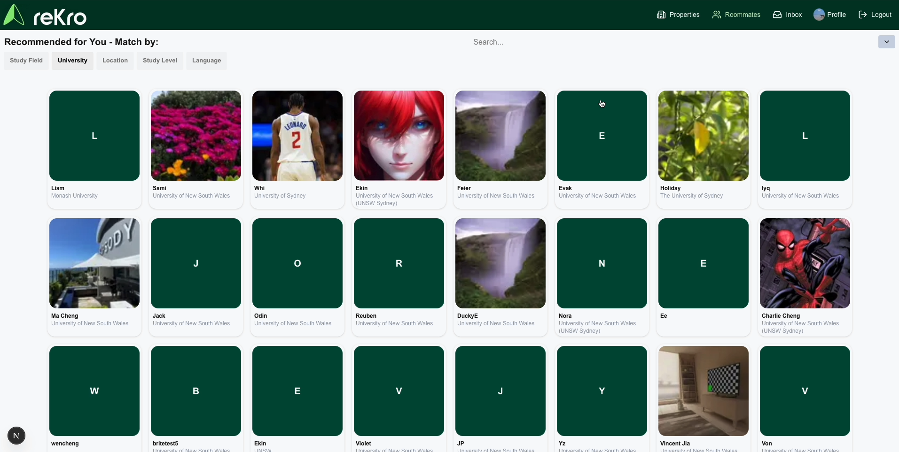

# reKro

Working in a group, we designed and built a functional webapp for finding student accommodation for university students
in Sydney. This involved multiple stages of design and weekly meetings with a client for development updates and design
decisions.

We had to produce a scope of work, multiple demo stages including a minimum viable product, and final documentation on
using the webapp after a handover.

Another essential part of this project was the development of group working skills. We used organisation tools including
Jira as well as held retrospective meetings to discuss organisational strongpoints and drawbacks.

For the development of our webapp we utilised Next.js and an existing Supabase database for easy deployment and to
maintain compatibility with an existing mobile app.

_Technology Utilised: Typescript, React, Next.js, Supabase, Github, Jira, Google Slides/Docs_