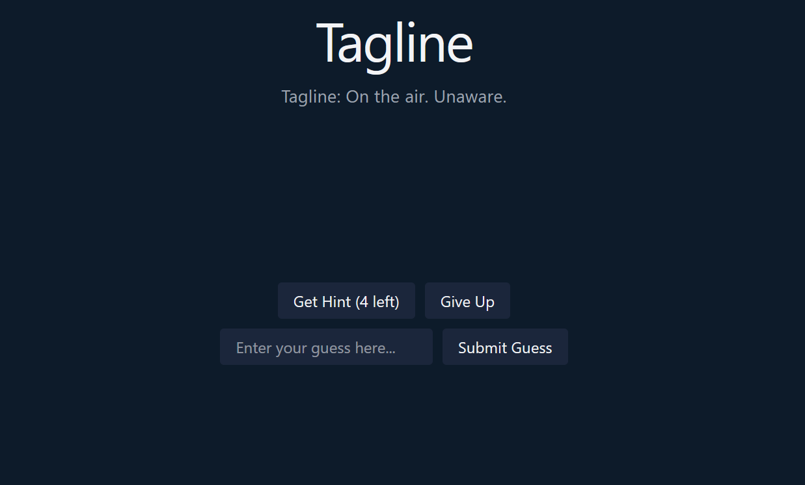

# Tagline

Tagline is a simple guessing game that runs within a single docker container, making it easily self-hostable.

[See Tagline Here](https://github.com/ConMan7X/tagline)

The game itself involves guessing a movie based on the tagline or promotional line of the movie. If you can't guess the movie, you can get various hints to help you guess.

The frontend is very simple and written in react for simple styling and fetching of information.

The backend is written in Rust, using the axum package. All movie details are fetched from [TMBD](https://www.themoviedb.org/). Tagline also features a way to play the game in the CLI, without the need for a browser.

_Technology Utilised: Rust, React, Docker_
